# シェアランキング

ユーザーだけのランキングを作成したり、ランキングの雛形を作成する事で他のユーザーに投票してもらい、ユーザー全体で作り上げるランキングアプリです。

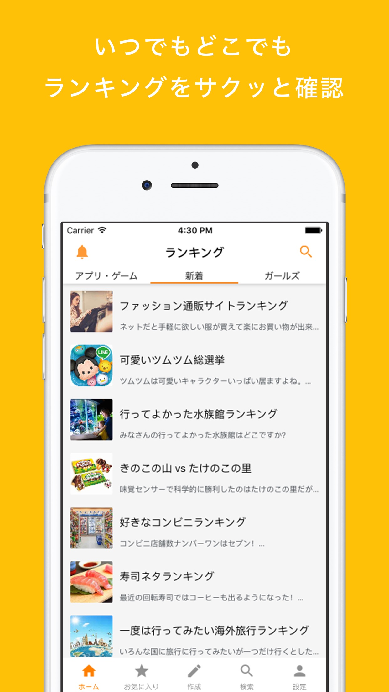 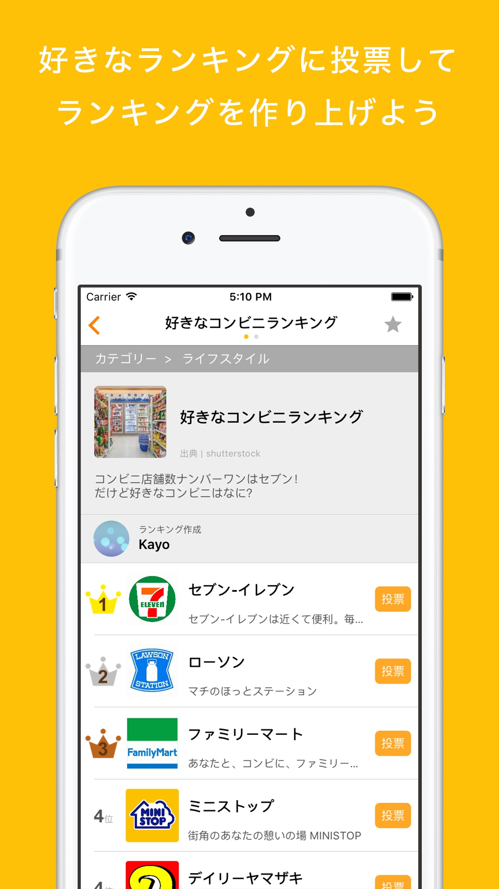 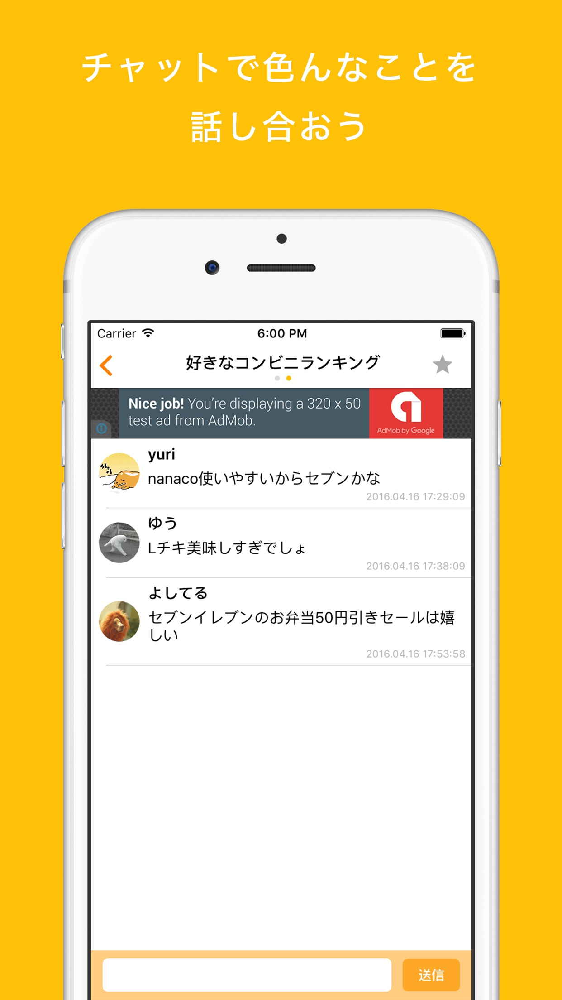 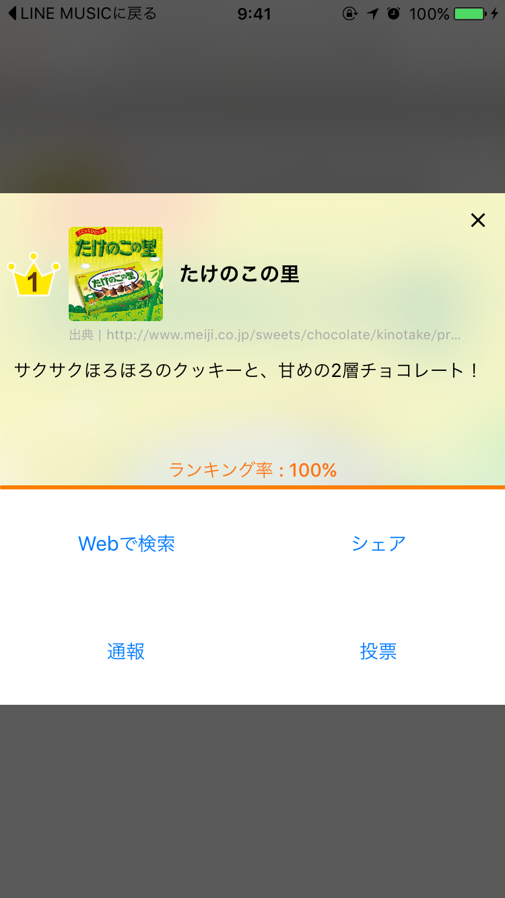

 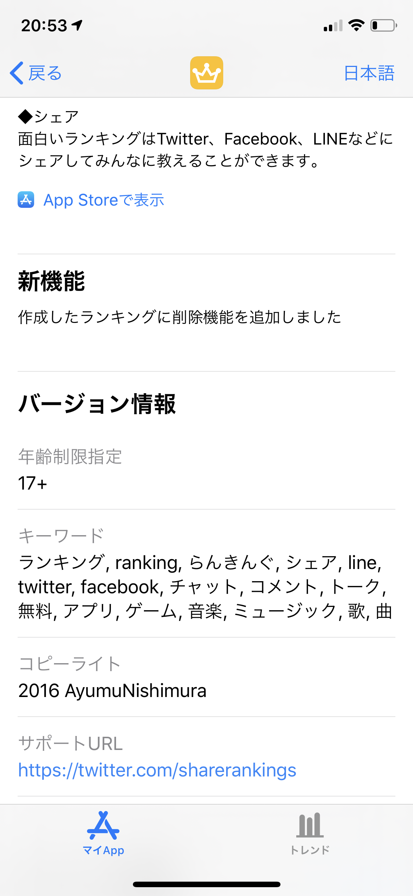

<h3>・スワイプタブ画面遷移</h3>

グノシーやスマートニュースのような、画面スワイプで次の画面へ遷移出来る機能を実装しています。 
画面遷移自体は簡単に開発することが出来ましたが、画面上部にあるナビゲーションバーの開発が特に苦労しました。 
ナビゲーションバーは、「現在ページのアクティブ化・画面スワイプに連動してナビバーの動作・ナビバーをタップするとそれに合わせて画面遷移・どれだけ横にスライドさせても途中で止まることなく画面遷移（ループ）」など様々なことを考慮しながら開発を行ったので完成までに時間がかかりました。 
最終的には苦労しながらも諦めることなく完成させる事が出来たので、自身の成長に繋がったと感じております。

<h3>・リアルタイムチャット</h3>

リアルタイムチャットの実装では、ポーリング技術のようにリロードしてコメントを読み込むのではなく、WebSocketを使用してリアルタイムでチャットが反映されるように実装しています。 
使用技術は、Node.jsとSocket.IOを使用しています。 
当時は、サーバーについてはほぼ未経験だったので知識が全くない状態からスタートしました。 
Node.jsの技術書を読んだり、公式ドキュメントを読み込みながら理解し着実に進めていったので、サーバーの知識と経験が身につく良い勉強になったと感じています。

<h3>・デザイン</h3>

アイコン作成や各画面のデザインまで全て１人で行いました。 
今までプログラムしか触って来なかったので、デザインに関する知識が全くありませんでした。 
まずは、知識を付けるためデザインに関する参考書やweb記事を読むことから始めました。 
学んでいく中で一番参考になったのは、他のwebサービスがどんな思いでこのデザインにしているか自分なりの考えで理解していくことでした。 
そのお陰で、どうしたら使いやすいアプリになるのか考えることが出来るようになり、ユーザーの目線に立って使いやすいアプリを開発する事が出来ました。

# ペットSNS

インスタグラムライクなiOSアプリです。 このアプリでは、ペットの写真を投稿したりライブ配信をする事が出来ます。

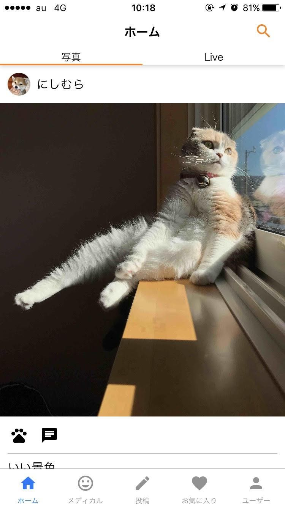 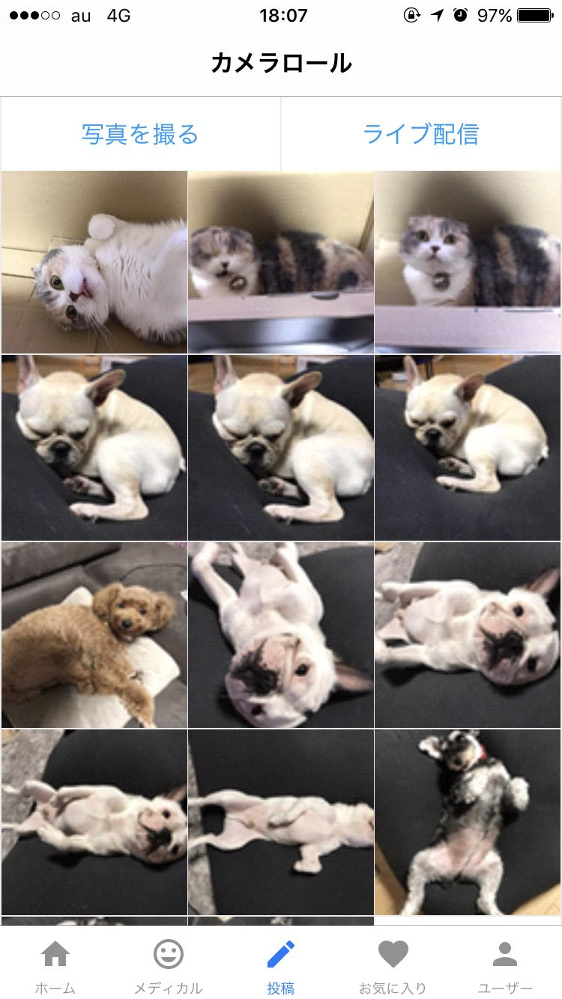 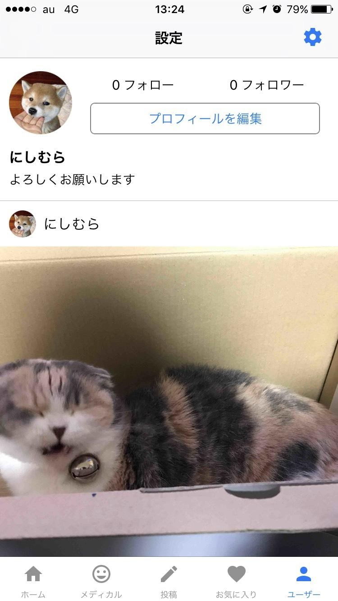 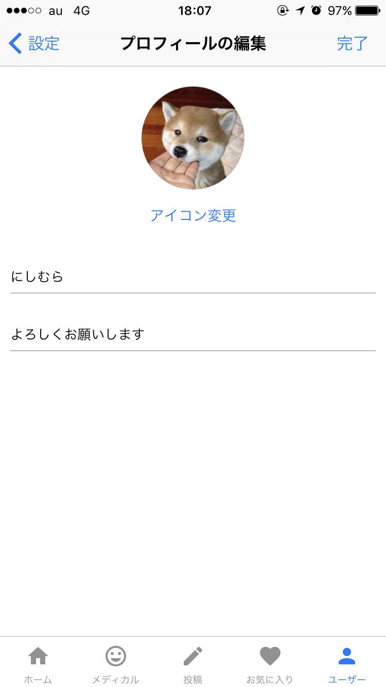

<h3>・ライブ配信</h3>

ライブ配信基盤として活用したのは、NginxのRTMPモジュールです。 
RTMPモジュールを使用することで簡単にライブ配信を行うサーバーの準備は整ったのですが、iPhoneのアプリからライブ映像が流れないなど問題が発生しました。 
公式ドキュメントやネット記事などでストリーミングについての知識を深め、どこで問題が発生しているのかを理解し問題解決に努めました。

次に問題が発生したのが、ライブ映像画面とコメント画面の連携でした。 
各画面は別々のViewですが、１つのページに２分割になって表示されています。そこの画面間のView連携がなかなか上手くいきませんでした。 
問題は自分自身のObserverパターンに対する理解能力不足だと考え、ドキュメントなどを見直し学習し直しました。 
理解力がついた結果、スムーズに問題を解決することができ無事サービスを完成させることが出来ました。

# ブックマーク共有
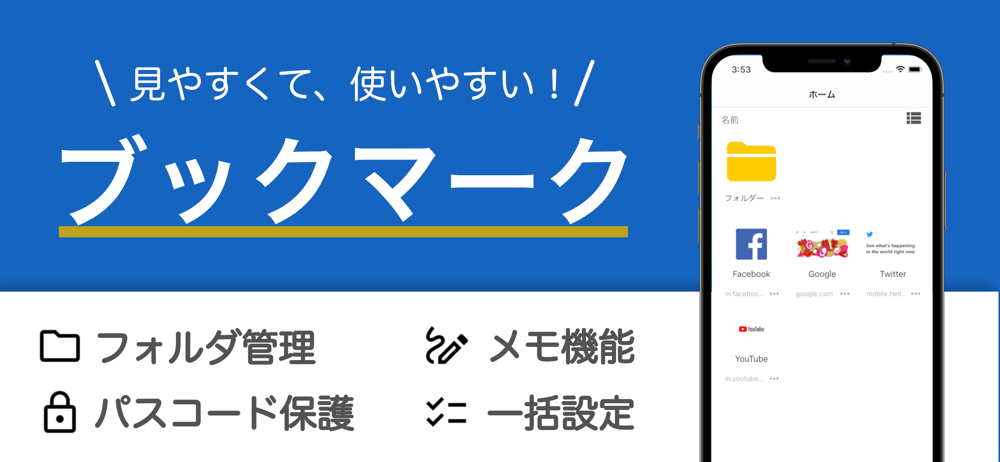 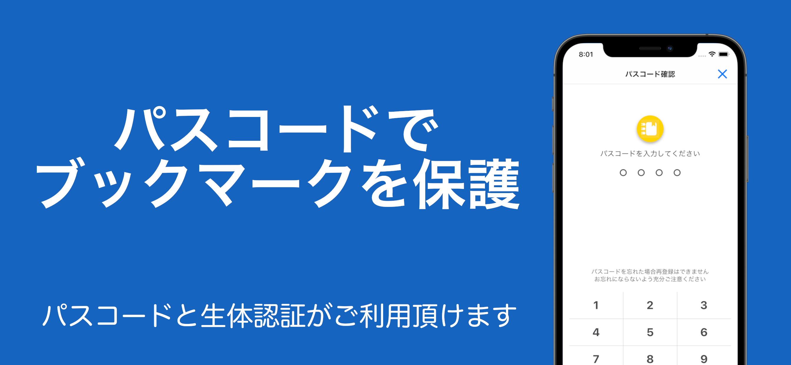 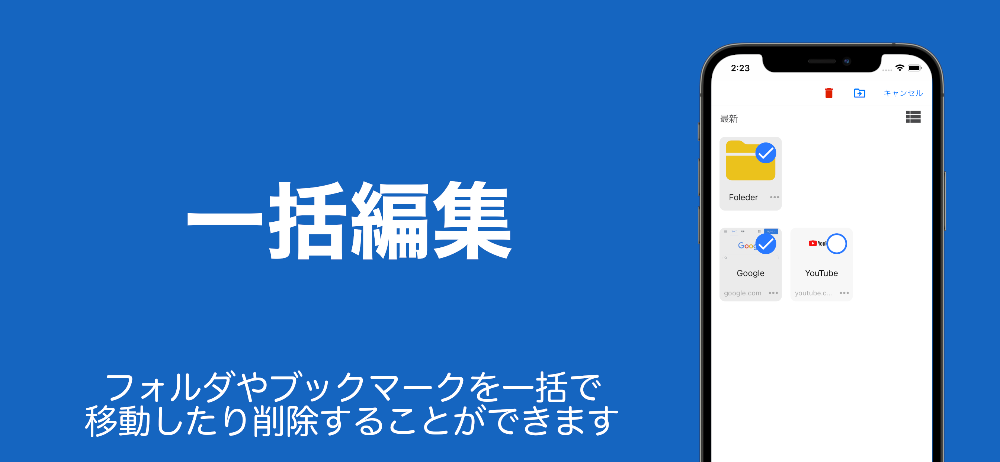 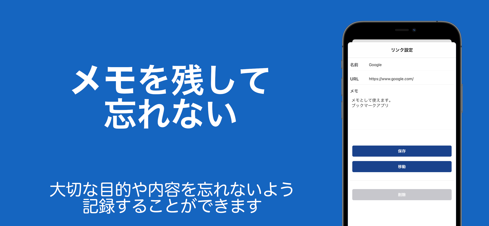

現在開発中のiOSアプリになります。

現状ブックマークの登録などができるようになっています。

スケールが大きいアプリを開発する際にMVCアーキテクチャでは、ファットビューコントローラーになりやすいことから様々なアーキテクチャを試し現在開発しているiOSアプリではViperを採用しました。 
結果、依存性が分離され追加変更や修正が容易になり開発効率が改善しました。

コールバック地獄など起こさないためなど、非同期処理のプログラムを簡潔に記述出来るようにRxSwiftの導入もしています。

<a href="https://apps.apple.com/jp/app/id1554834738#?platform=iphone">App Store(https://apps.apple.com/jp/app/id1554834738#?platform=iphone)</a>
